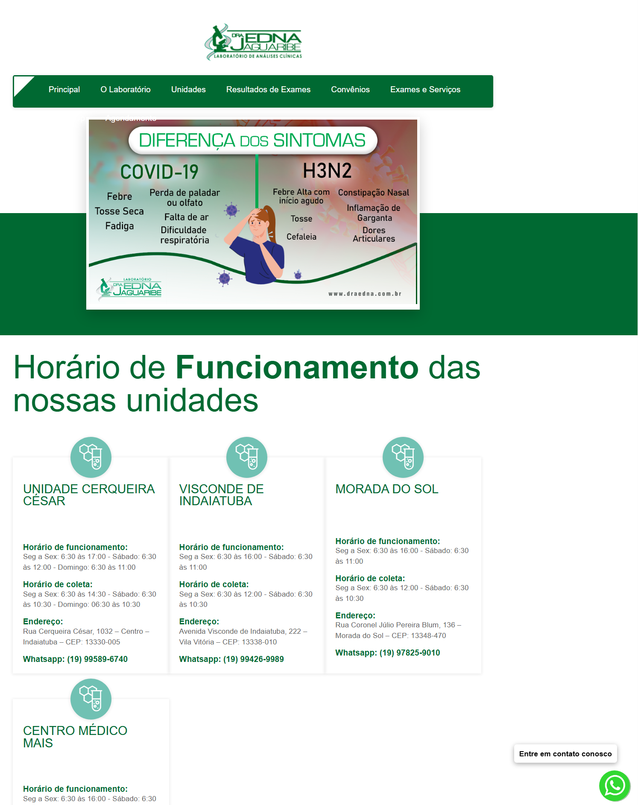
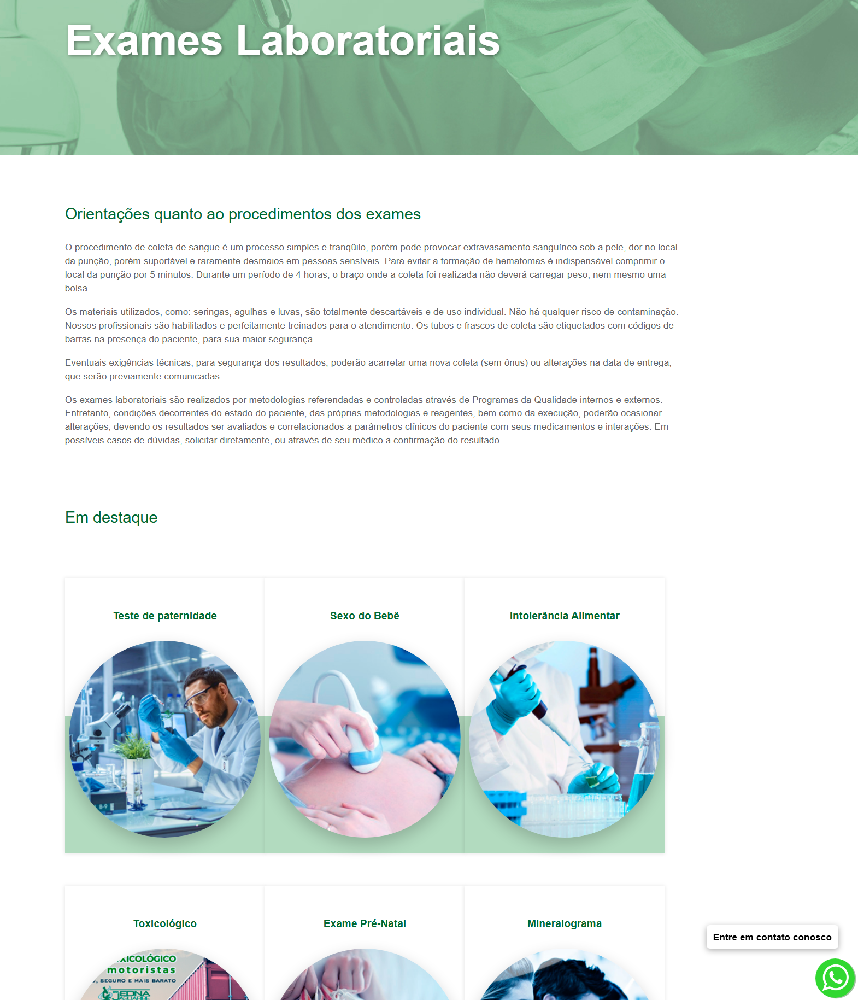
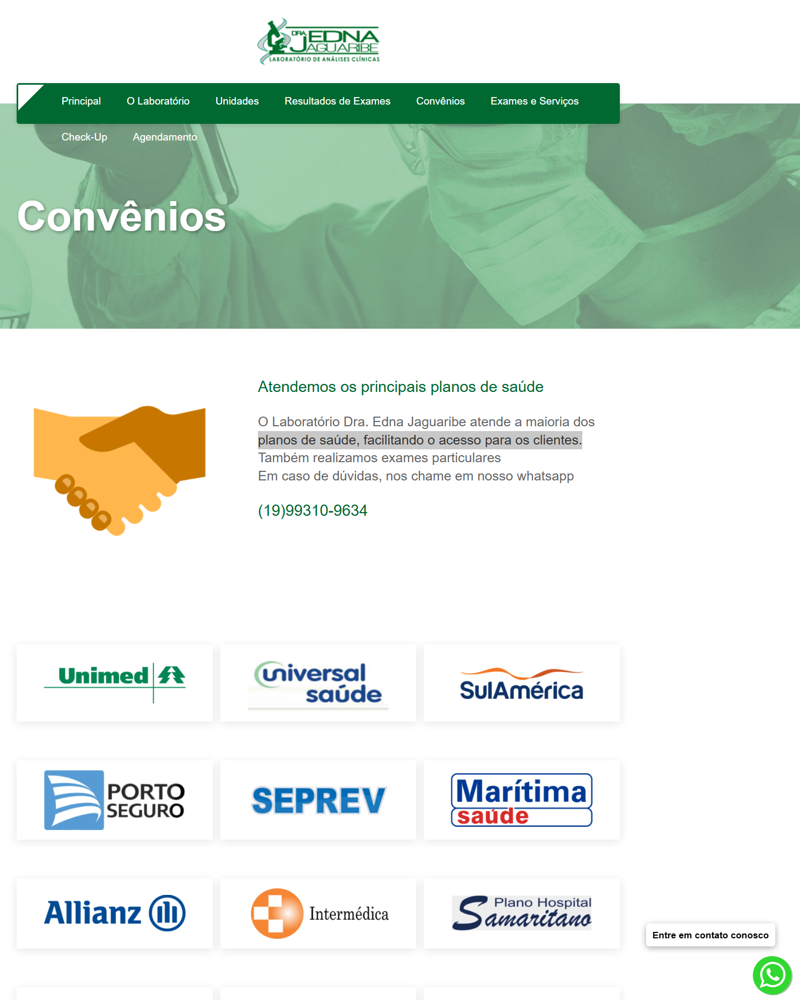
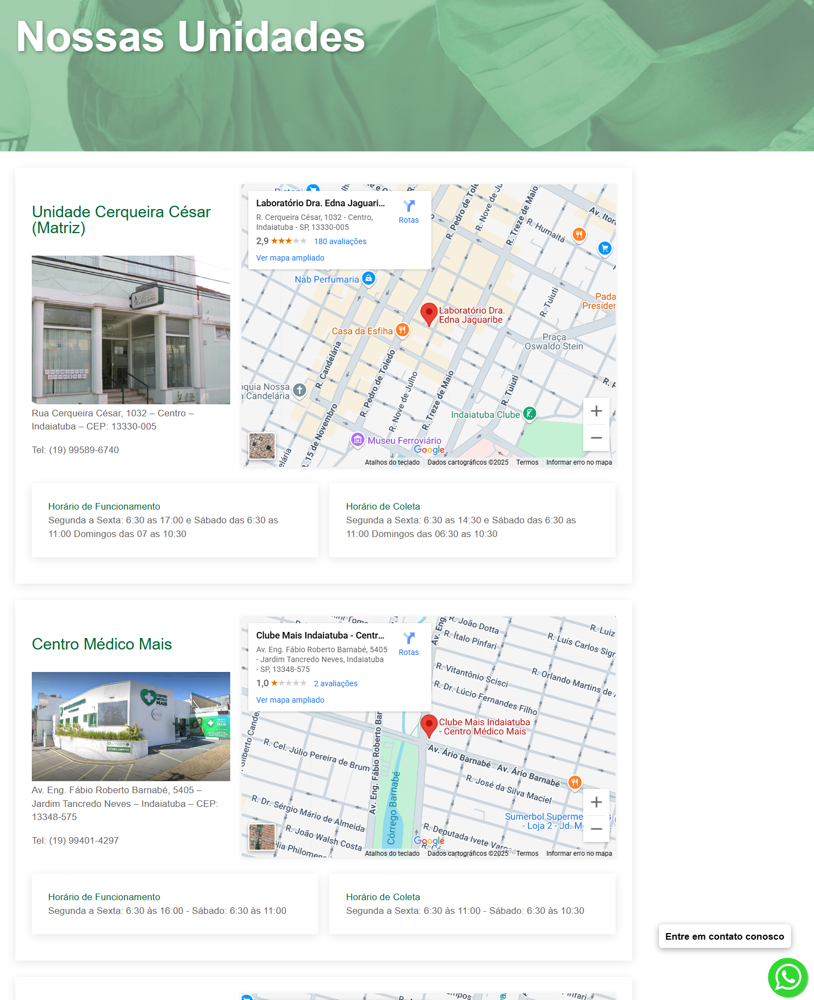
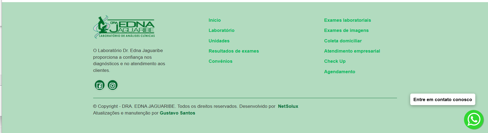

# Site do Laboratório Dra. Edna Jaguaribe

Este repositório contém arquivos e exemplos de manutenção técnica realizada por mim no site institucional do laboratório.

## 🛠️ O que foi feito

- Atualizações no front-end
- Ajustes de layout e responsividade
- Ajustes no backend e banco de dados
- Melhoria no CSS
- Correções técnicas de funcionamento

## 🔗 Site no ar

[Acessar site oficial](https://www.draednajaguaribe.com.br)

## 🖼️ Funcionalidades Visuais

### Página Inicial

### Página de Resultados de Exames

### Página de convenios

### Página de unidades

### Rodapé

## 🧑‍💻 Responsável pelas atualizações

Gustavo Santos  
[GitHub](https://github.com/Gustavix320)
